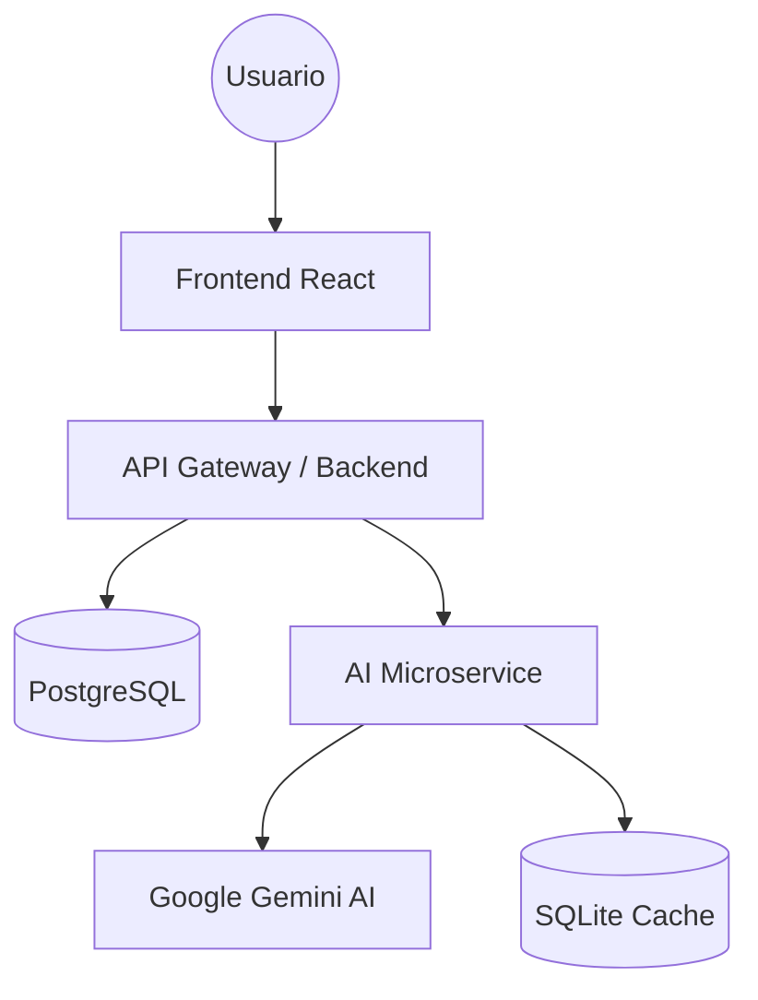

# 🎯 Batería de Preguntas — Ecosistema Inteligente de Oposiciones

[](https://nodejs.org/)
[](https://reactjs.org/)
[](https://postgresql.org/)
[](https://docker.com/)
[](#-arquitectura-ia)

BateriaQ no es solo un banco de preguntas; es una **plataforma de aprendizaje adaptativo de misión crítica**. Combina una arquitectura de microservicios distribuida con un motor de Inteligencia Artificial para ofrecer una experiencia de estudio personalizada, eficiente y gamificada.

---

## 📖 Manuales de Uso

Hemos preparado guías detalladas para que aproveches la plataforma desde el primer segundo:

- **[🎓 Manual del Estudiante](docs/MANUAL_ESTUDIANTE.md)**: Cómo estudiar, usar la IA y dominar los tests.
- **[🛠 Manual del Administrador](docs/MANUAL_ADMIN.md)**: Guía de gestión de usuarios y contenido.

---

## 🏗 Arquitectura del Ecosistema

El sistema se divide en tres capas independientes que colaboran en tiempo real:



### 1. **API Gateway (Backend)**
El cerebro logístico. Gestiona la autenticación (JWT), la persistencia en base de datos, las estadísticas y la orquestación del contenido. Sigue una arquitectura **Clean Architecture** para máxima mantenibilidad.

### 2. **AI Microservice (Tutor Inteligente)**
Capa aislada dedicada al procesamiento de lenguaje natural. 
- **Model Fallback**: Sistema de cascada entre Gemini Pro y Flash para asegurar respuestas inmediatas.
- **Capa de Caché**: Utiliza SQLite para recordar explicaciones ya generadas, optimizando costes y velocidad.
- **Tutor IA**: Asistente en tiempo real que resuelve dudas legales y pedagógicas.

### 3. **Frontend (Dashboard de Alto Rendimiento)**
Interfaz "Dark-First" diseñada para largas sesiones de estudio sin fatiga visual. 
- **Design System Premium**: Uso de Glassmorphism, CSS variables y micro-animaciones.
- **Modo Offline-First**: Preparado para resiliencia en conexiones inestables.

---

## 🔥 Características de Élite

### 🤖 Inteligencia Contextual (IA)
- **Tutor Personal 24/7**: Chat flotante para resolver cualquier duda sobre el temario.
- **Explicaciones Estratégicas**: Análisis de errores fallados con mnemotecnias personalizadas.

### 🛠 Panel de Administración (CMS)
- **Gestión Global**: Control total de usuarios, roles, temas y preguntas.
- **Mantenimiento**: Supervisión de la salud del sistema y caché de IA.

### 📚 Metodologías de Estudio
- **Algoritmo SM-2**: Repetición espaciada para memorización a largo plazo.
- **Modo Sin Fallos**: Bloqueo de avance hasta el dominio total del bloque.
- **Banco de Errores**: Inteligencia sobre tus propios fallos para repetición enfocada.

---

## 🚀 Despliegue Rápido (Docker)

La forma más rápida de ver el sistema en acción:

```bash
# 1. Preparar entorno
cp .env.example .env

# 2. Arrancar infraestructura
docker-compose up -d --build

# 3. Inicializar datos (Seed)
docker exec bateria-backend npx prisma migrate deploy
docker exec bateria-backend node prisma/seed.js

# 4. Acceder
# Frontend: http://localhost
# Admin: admin@bateriapreguntas.com / Admin@2024!
```

---

## 👤 Usuarios de Prueba

| Rol | Email | Contraseña | Privilegios |
|-----|-------|-----------|-------------|
| **Administrador** | `admin@bateriapreguntas.com` | `Admin@2024!` | Gestión total del CMS |
| **Estudiante Demo** | `demo@bateriapreguntas.com` | `User@2024!` | Acceso a temas y tutor IA |

---

## 📁 Estructura del Tesoro

- `/backend`: Lógica principal, Auth, DB y Estadísticas.
- `/frontend`: SPA en React con el Design System.
- `/ai-microservice`: Capa de IA aislada con Gemini Integration.
- `/docker-compose.yml`: Orquestador de la infraestructura.

---

## 🛡 Seguridad (OWASP Compliant)

- **Cifrado**: Contraseñas con Bcrypt (12 rounds).
- **Control**: RBAC (Role-Based Access Control) estricto.
- **Protección**: Helmet, Rate Limiting y sanitización de entradas Zod.

---

**Desarrollado con ❤️ para opositores que buscan la excelencia.**
