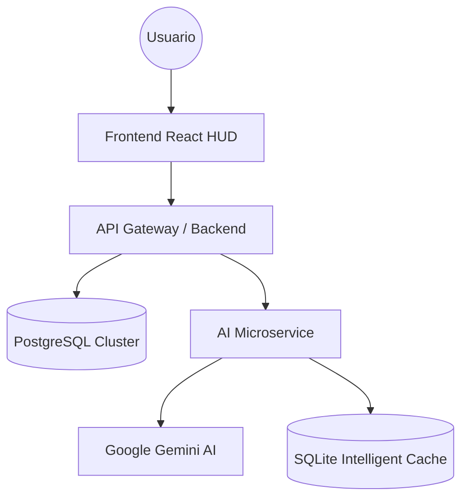

<div align="center">


# 🎯 BATERÍA DE PREGUNTAS
### `INTEL_EDUCATIONAL_ECOSYSTEM_v2.0`

[](https://nodejs.org/)
[](https://reactjs.org/)
[](https://postgresql.org/)
[](#-arquitectura-ia)

**BateriaQ** is a mission-critical adaptive learning platform. It combines a distributed microservices architecture with an AI core to deliver a high-performance study experience.

</div>

---

### 📖 DOCUMENTACIÓN ESTRATÉGICA

> [!IMPORTANT]
> Hemos preparado guías detalladas para maximizar tu rendimiento:

- **[🎓 Manual del Estudiante](docs/MANUAL_ESTUDIANTE.md)**: Domina el ritmo de estudio y el Tutor IA.
- **[🛠 Manual del Administrador](docs/MANUAL_ADMIN.md)**: Gestión de activos, usuarios y telemetría de contenido.

---

### 🏗️ ARQUITECTURA DEL ECOSISTEMA



#### 📡 Capas del Sistema:
1.  **API Gateway**: Motor logístico con **Clean Architecture**. Gestión de JWT y persistencia.
2.  **AI Microservice**: Capa aislada con **Model Fallback** (Gemini Pro/Flash) y persistencia en caché SQLite.
3.  **Frontend HUD**: Interfaz "Dark-First" con **Glassmorphism 4.0** y diseño resiliente.

---

### 🔥 CARACTERÍSTICAS DE ÉLITE

#### 🤖 Inteligencia Contextual
- **Tutor Personal 24/7**: Chat cognitivo integrado para resolución de dudas en tiempo real.
- **Explicaciones Estratégicas**: Mnemotecnias generadas por IA basadas en patrones de error.

#### 📚 Metodologías de Alto Rendimiento
- **Algoritmo SM-2**: Repetición espaciada para memoria profunda.
- **Modo Sin Fallos**: Bloqueo de progresión por maestría de bloque.
- **Contenido Comunitario**: Los usuarios pueden crear sus propias oposiciones, temas y preguntas.

---

### 🚀 DESPLIEGUE RÁPIDO (DOCKER_ENGINE)

Inicia el ecosistema completo en segundos:

```bash
# 1. Configurar Entorno
cp .env.example .env

# 2. Ignición de Infraestructura
docker-compose up -d --build

# 3. Protocolo de Datos (Seed)
docker exec bateria-backend npx prisma migrate deploy
docker exec bateria-backend node prisma/seed.js
```

> **Access URL**: `http://localhost`  
> **Admin Credentials**: `admin@bateriapreguntas.com` / `Admin@2024!`

---

### 👤 MATRIZ DE ACCESO

| Rol | Credenciales | Privilegios |
| :--- | :--- | :--- |
| **Administrador** | `admin@bateriapreguntas.com` | Control Total CMS / Salud del Sistema |
| **Estudiante** | `demo@bateriapreguntas.com` | Estudiar / Crear Propias Oposiciones, Temas y Preguntas |

---

<div align="center">

© 2026 **ALBA-OS EDUCATIONAL DIVISION**
*Desarrollado para opositores que buscan la excelencia absoluta.*

</div>
